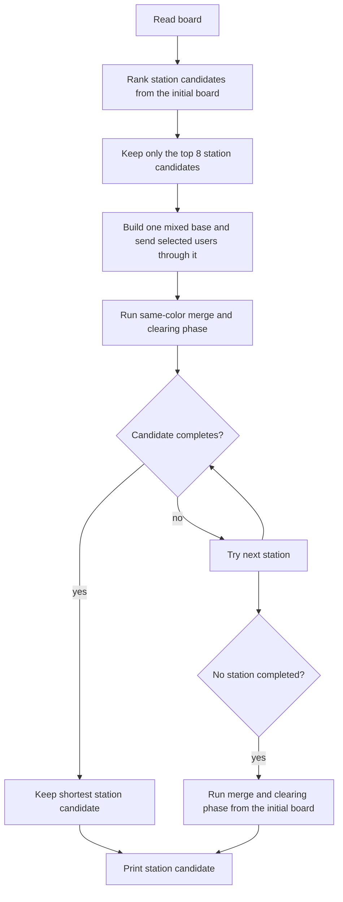
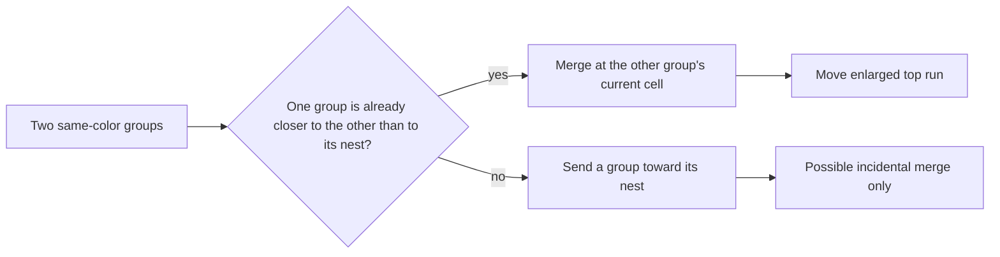

# Feature priority versus certainty

This document describes how the current solver chooses actions and where a high-priority decision relies on a weak estimate.

## Actual decision flow



The important branch is at the end: a complete station candidate is accepted without comparing it against the no-station candidate. The direct merge-and-clear path runs only when every station candidate fails.

## Priority and certainty map

| Feature | Where it decides | Priority in current solver | Certainty that it improves actions | Resulting risk |
| --- | --- | --- | --- | --- |
| Exact move simulation and replay | Every emitted move and final candidate | Highest | High | Good: legality and completion are checked exactly. |
| Station phase exists | `main` tries stations before any fallback | Highest strategic priority | Low | A station can control the entire output even when it costs more than clearing normally. |
| Station ranking | Initial-board proxy score | High | Low | Only eight candidates survive, although the best actual candidate may be outside those eight. |
| Station user selection | Positive static jump estimate | High inside a station | Low | A slime can be routed away from its nest because an estimated first jump looks beneficial. |
| Same-color merging | `Planner::finish` | Medium | Medium | Merges are legal and often useful, but they occur only after the station phase and only under a narrow condition. |
| Direct clearing | Fallback only | Lowest | High | The reliable baseline is not allowed to compete on actual action count. |

## Why a slime can move far away from its nest

The station user score is built from this idea:

```text
estimated benefit = first station jump saving - detour through station
```

The estimate is weak in four ways.

1. **It measures grid edges, not emitted actions.**

   The detour and direct route are BFS distances. A route with several retained launch bases may need far fewer operations than its edge length. A route with turns may need more. The estimate treats both as ordinary walking.

2. **It credits one ideal first jump only.**

   The saving assumes the station has height four and that the first route segment from the station is straight. It does not price later turns, landing stacks, or the actual path chosen after the board changes.

3. **It is computed before any station donor or user moves.**

   The score cannot see a changed stack height, a same-color merge, or a path whose landing capacity becomes unavailable after the base is built.

4. **A positive local estimate is enough.**

   Up to 32 users with individually positive estimates are admitted. Their combined traffic, lost merge opportunities, and the cost of building and later dismantling the base are not jointly evaluated.

The final replay checks that this plan is legal, but it does not check whether another complete plan uses fewer moves.

## Why same-color slimes still fail to travel together

The merge mechanic itself is now present: when a travelling monochromatic block lands on the same color, its next departure includes the enlarged top run.

The scheduling layer still misses most useful merges.



This leaves three gaps.

1. **No rendezvous cells.**

   The solver only merges at the current cell of another same-color top run. It never evaluates an empty cell or a station as a meeting point for two same-color groups with a shared suffix.

2. **No shared-route evaluation.**

   The merge score asks only whether reaching the other group is shorter than reaching the nest. It does not evaluate how much of the remaining route is shared, how many jumps the merged height enables, or whether a different path has a better common suffix.

3. **Station users deliberately suppress merging.**

   While using a station, every user is moved as exactly one slime so the mixed base remains untouched. Two same-color station users therefore leave one after another instead of waiting and departing as one merged group. This is a protected-base rule, but it loses same-color transport savings.

## Interaction policy: intended versus accidental

| Interaction | Current policy | Certainty | Problem |
| --- | --- | --- | --- |
| Same color lands on same color during `finish` | Merge immediately | High legality, medium value | Good local rule, but the scheduler seldom creates this landing. |
| Different color is crossed during a route | Use it as an immediate base and continue | High legality | Reasonable when the route continues without a new scheduling decision. |
| Different colors form a station base | Keep the base until all selected users leave | High legality, low value estimate | The base colors and order are selected from static distances, not future route demand. |
| Different colors arrive at an ordinary occupied cell | Allowed as a transient route landing | High legality, uncertain value | The route search does not decide whether that stack interaction is useful. |

## Correct priority order

The solver should rank complete plans by their replayed action count, with the following decision order:

```text
1. Generate a direct merge-and-clear candidate.
2. Generate station candidates.
3. Generate rendezvous candidates for same-color groups with common route suffixes.
4. Replay every complete candidate.
5. Select the least-action complete candidate.
```

Within a candidate, use this order:

```text
preserve a useful base
    > merge compatible same-color groups
    > use a transient different-color launch base
    > take a detour solely for a predicted station jump
```

The last action needs the strongest evidence, but the current implementation gives it the earliest and strongest control over the output. That reversal is the main logical flaw.

## Missing evaluation layers

- Compare station, merge-only, and direct candidates by replayed move count.
- Score a merge by its common suffix and actual jump opportunities, not only one distance inequality.
- Search meeting cells for same-color groups instead of only merging at one group's current cell.
- Make station users batch by color when their departure suffix is compatible, then preserve the mixed base below that batch.
- Re-evaluate candidate values after each material stack change instead of relying only on initial-board distances.
